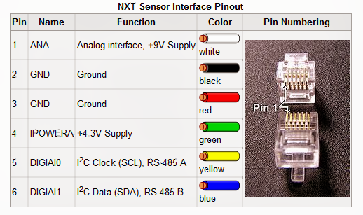

# HiTechnic-Compass-sensor

Arduino Code to communicate with the HiTechnic Compass sensor and receive the heading data

---

## 🧠 What is this?

A company called HiTechnic launched a sensor called "HiTechnic Compass sensor" a while back. While intended for use with the Lego® NXT and EV3 systems, it remains as one of the most reliable and easy-to-use compass sensors ever. Even with an Arduino!

---

## ⁉️ Isnt This a Lego® sensor?
Yes, and as such, using it with an arduino has more challenges than the code. 
- How to connect it to the Arduino? Well, Lego® uses I2C communication which is standard everywhere, so with a cut-open Lego cable, connections are easy to make as long as you have a basic understanding of pinouts and soldering skills.
- **WARNING: While it could work, I highly discourage you from twisting wires without proper soldered connections because I2C is a very picky protocol. It won't cause damage but will likely cause frustration and seemingly not functional setups**

I have provided the pinout of the cable 👉

---

## 🔧 What to expect

- The code should output a **stable** heading angle from 0-360 degrees and shouldn't freeze.

---

Feel free to use the code for your projects.
